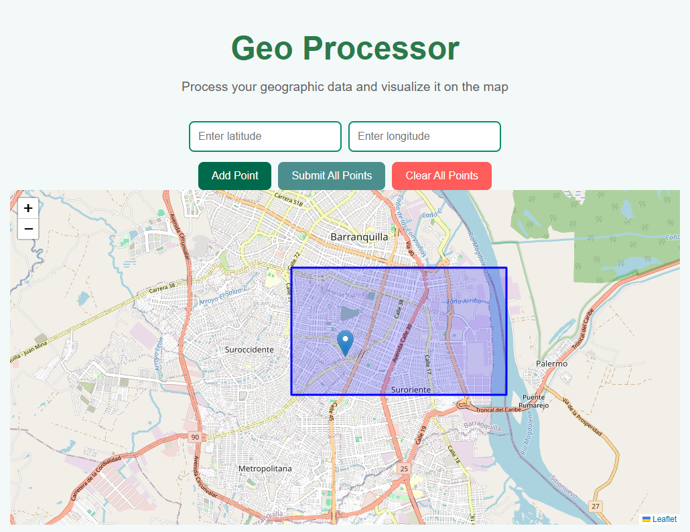

# geo-processor
Microservice ecosystem working with map coordinates.
Here is a detailed overview of the structure and setup for your project:

### Project Structure

1. **Root Folder**:

   * **docker-compose.yml**: This file is used for defining and running multi-container Docker applications. It links the different parts of your stack (frontend, backend, Python microservice) together.
   * **geo-processor-v1.0**: Main folder containing the sub-projects for the frontend, NestJS API, and Python microservice.

2. **Subfolders**:

   * **frontend**: Contains the frontend part of the application, built using Next.js.

     * **components**: React components used in the app.
     * **Dockerfile**: Defines how to build the frontend container.
     * **next.config.js**: Configuration file for the Next.js application.
     * **package.json / package-lock.json**: Dependency management for the frontend.
     * **pages**: Next.js pages (e.g., routes).
     * **public**: Static files like images, fonts, etc.
     * **styles**: CSS files for styling the application.

   * **nestjs-api**: Contains the backend API built with NestJS.

     * **Dockerfile**: Defines how to build the NestJS container.
     * **package.json / package-lock.json**: Dependency management for the API.
     * **src**: Source code for the NestJS application.
     * **tsconfig.json / tsconfig.build.json**: TypeScript configuration files.

   * **python-microservice**: Contains the Python microservice responsible for processing geospatial data.

     * **app**: Application code for the Python microservice.
     * **docker-compose.yml**: Defines the service for the Python microservice in Docker.
     * **Dockerfile**: Defines how to build the Python microservice container.
     * **README.md**: Documentation for setting up and running the Python microservice.
     * **requirements.txt**: Python dependencies for the microservice.

### Running the Project

To run the full project, you need Docker and Docker Compose installed on your machine. Here are the general steps to get everything up and running:

1. **Clone the repository** (if it's not already on your local machine).

2. **Navigate to the root folder** where the `docker-compose.yml` file is located.

3. **Build and start the services** by running the following command:

   ```bash
   docker-compose up --build
   ```

   This will:

   * Build the containers for the frontend (Next.js), NestJS API, and Python microservice.
   * Start the services defined in the `docker-compose.yml` file.

4. **Accessing the application**:

   * The frontend (Next.js) will be available on (`http://localhost:3000`).
   * The NestJS API will be available on ( `http://localhost:3001`).
   * The Python microservice will be available on ( `http://localhost:8000`).


### Why Separate Repositories and Ports?

The decision to separate each service (frontend, backend, and microservice) into its own repository and run them on different ports is driven by several key considerations:

1. **Microservices Architecture**:
   - By separating the backend and frontend into independent services, we adhere to a microservices architecture. Each service can be developed, deployed, and scaled independently, making the system more modular.
   - **Reasoning**: Microservices enable us to isolate issues, manage them separately, and scale each component independently.

2. **Docker and Containerization**:
   - **Docker** is used to containerize each of the services (frontend, backend, and microservice). Each service is packaged with its dependencies and environment, ensuring consistent behavior across different development and production environments.
   - **Reasoning**: Docker offers several advantages:
     - **Consistency**: Docker ensures that the application will run the same way across all environments (development, testing, production)
     - **Isolation**: Each service runs in its own container, isolated from others. This ensures that dependencies for one service don't interfere with others, and different versions of dependencies can be managed easily.
     - **Simplified Deployment**: Docker allows for easy deployment and automation. Using Docker Compose, you can define and run multi-container applications, making it easier to set up the entire stack with a single command.

3. **Different Ports for Each Service**:
   - The frontend, backend, and Python microservice run on separate ports (for example, `3000`, `3001`, and `8000` respectively).
   - **Reasoning**: Each service needs to run independently, and using different ports ensures they don’t interfere with each other. This also allows us to scale services individually.

4. **Scalability**:
   - Each service is designed to be independently scalable. If one service needs to handle more load (e.g., the Python microservice for geospatial computations), it can be scaled without affecting the others.
   - **Reasoning**: By having separate services, each one can be scaled based on its load, ensuring that the system as a whole can handle increased demand efficiently.


### Frontend Homepage

The following screenshot showcases the homepage of the project, built with Next.js. It allows users to interact with the interface to input coordinates and view the results of geospatial processing.


